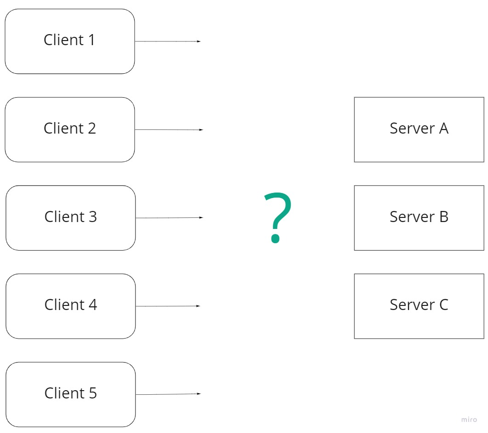
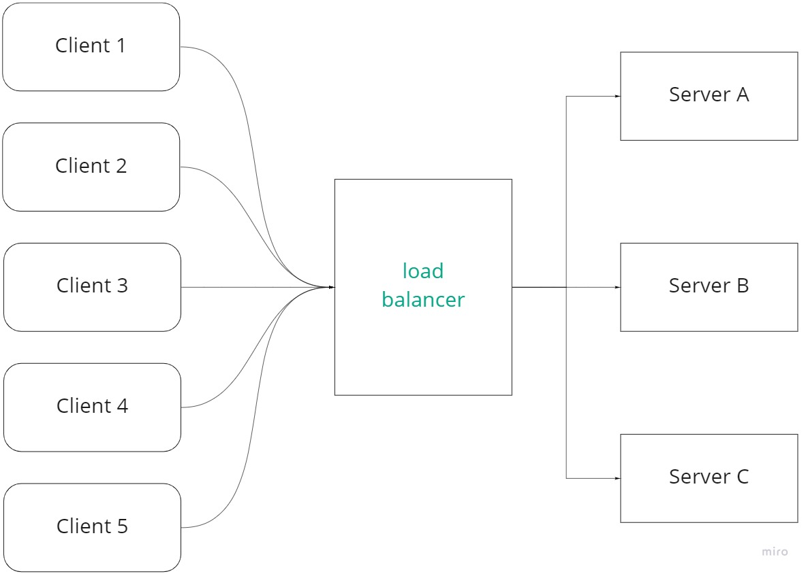
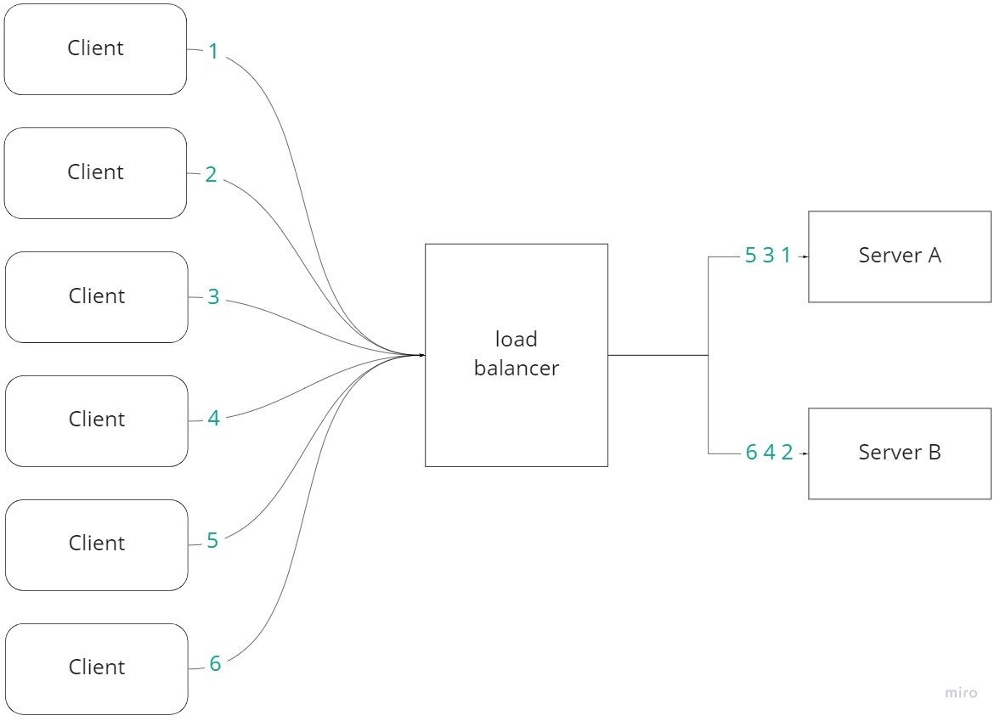
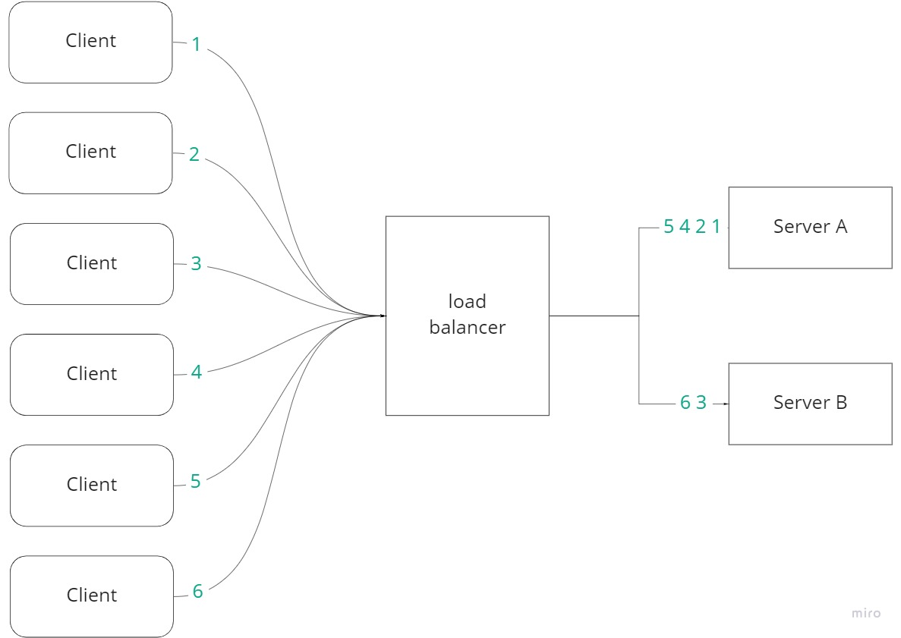
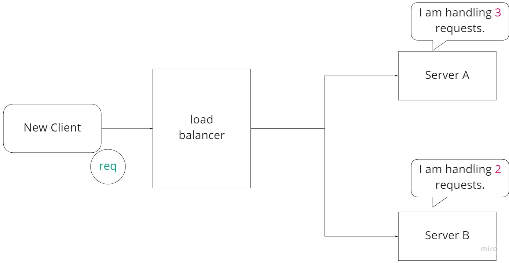
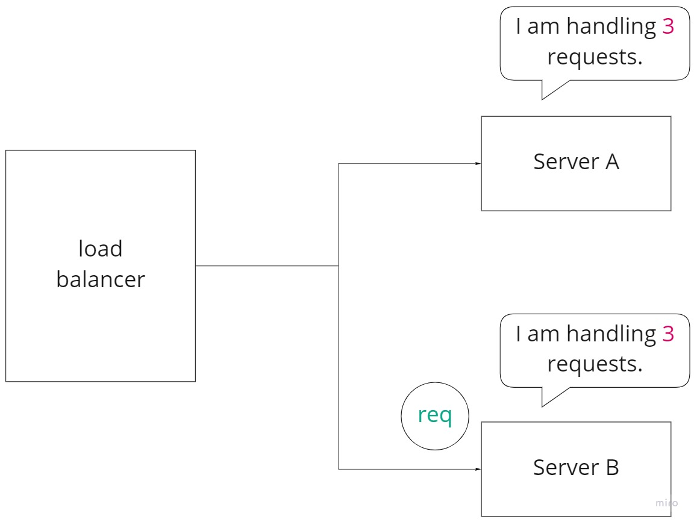
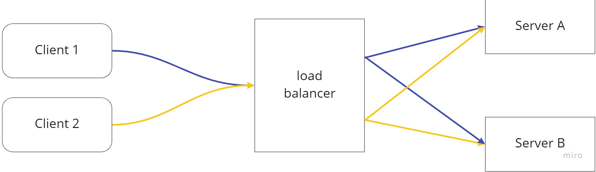
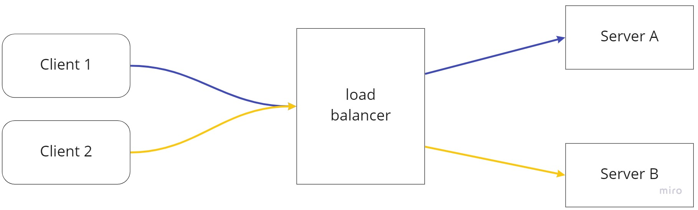
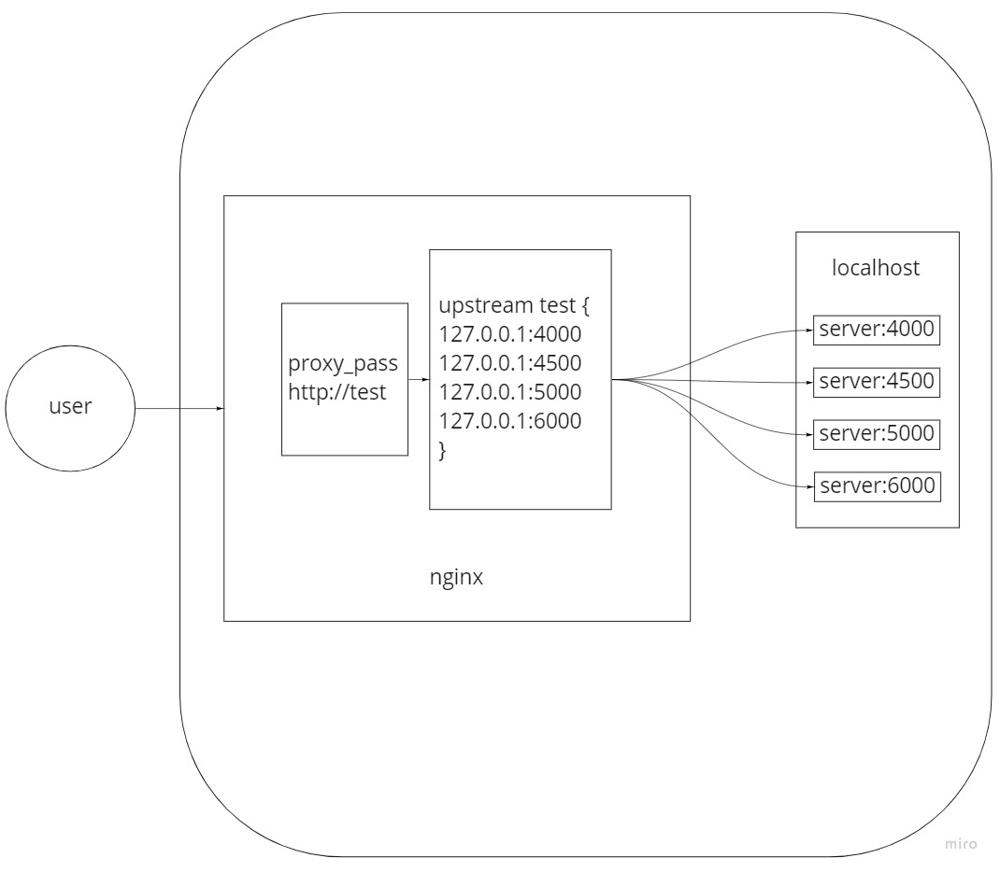

# Using Nginx as Load Balancer with Node.js (Express)

- The main introduction can be found at: https://philosophyotaku.medium.com/using-nginx-as-load-balancer-with-node-js-express-63b39948f737

# Introduction

One of the main features of Nginx is its load balancing functionality.    

In this article, I will show what it is, and how it can be done with a step-by-step in the following instruction.    

- Prerequisite
    - You need to already have Nginx installed on the Linux OS.
    - Better to have the basic idea of how config and log files work in Nginx.
    - The basic idea of Node.js (Express.js) is also required since this instruction will be done with it.

# What is Load Balancing

## Definition

- Sometimes we cannot handle tons of requests with only one server, so there might be two or more.
    
    
    
- With more than one servers, there will be a problem of how we should distribute the requests to a specific server.
    
    
    
- So we use a load balancer to solve this problem.
    
    
    
- In this case, we use Nginx as a load balancer.
- We can use different algorithm to decide which server a specific request will go to.

## Algorithm

Different services or servers have their own algorithm, and I will introduce only basic ones in Nginx.

### ****Round Robin Load Balancing****

- Definition: to distribute requests equally to different servers.
    
    
    

### ****Weighted Load Balancing****

- Definition: to distribute request based on the weights on server.



### Least Load(Connections) Balancing

- Definition: to distribute the requests to the least loaded(connections) server.



There is a new request, and there are two servers. Server B is handling less requests than Server A.



Since Server B was handling the least requests, this request will be sent to Server B

### (IP) hash ****Load Balancing****

- Definition: the requests coming from the same IP will always be sent to a specific server.



Without hash balancing



With hash balancing

### Health Checks

This is actually not an algorithm for load balancing.

Before sending requests to a server, Nginx will automatically check if the server is still working.

If the server is already down, Nginx will send requests to other servers, and we will be able to find an error log in Nginx. 

# Step1: Deploy four servers

The first thing is to deploy the four servers

1. Clone files from ‣
2. Do npm install
3. Run the three servers listening on 4000, 4500, 5000, and 6000.

---

Each server come with a unique response, so that we will be able to see, with load balancing, what response we will get. 

For example, the `app4000.js`  will simply respond `res on 4000`. If we get such response, we know our last request was sent to app4000.js by Nginx.

# Step2: Setting up Nginx

Noted again that you need basic ideas of how Nginx works, in order to follow.

## The figure

As illustrated in the figure, we use `proxy_pass` to send requests into `upstream` , and decide what algorithm we are going to use in `upstream.` 



The exact setting in Nginx comes in like this

```
upstream test {
        #ip_hash;
        #least_conn;
        server 127.0.0.1:4000;
        server 127.0.0.1:4500; #max_fails=3 fail_timeout=5s;
        server 127.0.0.1:5000; #weight=2;
        #server 127.0.0.1:6000;
 }

server {
  listen 80;
  access_log   /var/log/nginx/nginx.vhost.access.log;
  error_log    /var/log/nginx/nginx.vhost.error.log;

  location / {
          proxy_pass http://test;
  }
}
```

## ****Round Robin Load Balancing****

The default algorithm is Round Robin. 

If we set upstream like this:

```
upstream test {
        server 127.0.0.1:4000;
        server 127.0.0.1:4500; 
        server 127.0.0.1:5000;
     }
```

Since there are three servers listening on 4000, 4500, and 5000, requests will be sent to these three servers in sequence, as shown in the following video.

[1. nginx-load-balancer-default.mp4](./video/1.%20nginx-load-balancer-default.mp4)

## Weighted Load Balancing

If we add two weights on server 5000 and send four requests:

```
upstream test {
        server 127.0.0.1:4000;
        server 127.0.0.1:4500; 
        server 127.0.0.1:5000 weight=2;
 }
```

We will see two of them coming from server 5000.

[2. nginx-load-balancer-weight.mp4](https://s3-us-west-2.amazonaws.com/secure.notion-static.com/135bd5f0-6eb1-4ead-9532-f311ce17b307/2._nginx-load-balancer-weight.mp4)

## IP Hash Load Balancing

If we set `ip_hash`, 

```
upstream test {
        ip_hash;
        server 127.0.0.1:4000;
        server 127.0.0.1:4500; 
        server 127.0.0.1:5000;
 }
```

We will see response coming from the same server. This is because Nginx has already remembered my IP and will always send me to the same server. 

[3. nginx-load-balancer-IP-hash.mp4](https://s3-us-west-2.amazonaws.com/secure.notion-static.com/31a5e33e-3272-4fbe-b1c9-deec040432e5/3._nginx-load-balancer-IP-hash.mp4)

## Least Connection Load Balancing

Set `least_conn`, and add a new server listening on 6000.

```
upstream test {
        least_conn;
        server 127.0.0.1:4000;
        server 127.0.0.1:4500; 
        server 127.0.0.1:5000;
        server 127.0.0.1:6000;
}
```

The server on 6000 will respond in 5 seconds because of `setTimeout`, like this

```jsx
app.get('/', (req, res) => {
	setTimeout(() => {
		console.log("on 6000"); 
		res.send('res on 6000'); 
	}, 5000);
})
```

As shown in the video, we can see the fourth server (the 6000 one) pending because of setTimeout. 

In this five seconds, any request will not be sent to this server thanks to `least_conn`. 

[4. nginx-load-balancer-least-connection.mp4](https://s3-us-west-2.amazonaws.com/secure.notion-static.com/318672ed-874d-4045-87ca-3b3687ea6937/4._nginx-load-balancer-least-connection.mp4)

## Health Checks

Shutdown the server listening on 4500, but don’t remove it from the upstream. 

```
upstream test {
        server 127.0.0.1:4000;
        server 127.0.0.1:4500;
        server 127.0.0.1:5000;
}
```

We will be able to see Nginx doing health check automatically, so the response will not come from server 4500, and can see error logs at the same time.

[5. nginx-load-balancer-fails.mp4](https://s3-us-west-2.amazonaws.com/secure.notion-static.com/9cdaad6b-0cd3-401d-81c0-c184e7b7cdf6/5._nginx-load-balancer-fails.mp4)

We can add more settings on server to decide what happens if a server goes down.

For example, `max_fails=3 fail_timeout=5s` means Nginx will try at most three times on this server, and will not try in the following 5 seconds if all three tries failed. 

```
upstream test {
        server 127.0.0.1:4000;
        server 127.0.0.1:4500 max_fails=3 fail_timeout=5s;
        server 127.0.0.1:5000;
}
```

[6. nginx-load-balancer-max-fails-timeout.mp4](https://s3-us-west-2.amazonaws.com/secure.notion-static.com/9ff3419c-d5ec-4a21-87a7-7bb442c9f99e/6._nginx-load-balancer-max-fails-timeout.mp4)

# Conclusion

In this article, I introduce the basic idea of load balancing with Nginx. 

The idea and the commands in Nginx should be simpler than expected, especially after grasping the core idea of why we need load balancing.
